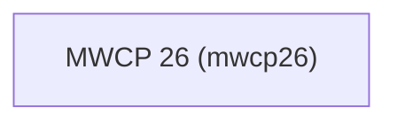

# mwcp26 — Modern Workplace Conference 2026

## Project overview

Projet de démo pour la Modern Workplace Conference 2026 (MWCP26). Solution Power Platform de présentation de l'agenda de la conférence : sessions, speakers, salles et planning interactif.

## Environments

| Environment | URL | Purpose |
|---|---|---|
| Dev | `https://chinnin-tech-dev.crm4.dynamics.com` | Active development |

## Publisher and project code

- **Publisher prefix:** `mwcp26_`
- **Project code:** `mwcp26`
- **Shared environment:** Oui

## Power Platform solutions

| Display name | Unique name | Description |
|---|---|---|
| MWCP 26 | `mwcp26` | Solution principale — agenda, sessions, speakers et planning de la conférence |



## Global architecture

<!-- Mermaid diagram: tables, apps, flows, external systems, plugins. -->

## Prerequisites

- `pac` CLI ≥ 1.35
- Python ≥ 3.10
- Node ≥ 18

## Getting started

```sh
# Commands a new developer runs after cloning
```

## Repository map

<!-- One line per top-level folder. -->
