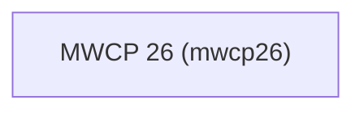

# mwcp26 — Modern Workplace Conference 2026

## Project overview

Projet de démo pour la Modern Workplace Conference 2026 (MWCP26). Solution Power Platform de présentation de l'agenda de la conférence : sessions, speakers, salles et planning interactif.

## Environments

| Environment | URL | ID | Purpose |
|---|---|---|---|
| Dev | `https://chinnin-tech-dev.crm4.dynamics.com` | — | Active development (main branch) |
| TCH | `https://chinnin-tech-tch.crm4.dynamics.com` | `86021eb6-8c40-ea18-aba0-208524dc4d42` | Demo branch (`demo/0-initapp`) — Code App agenda |

> **Branch `demo/0-initapp`** : cet environnement cible **TCH** (`chinnin-tech-tch`). Le fichier `.env` local doit utiliser `PAC_AUTH_PROFILE=CHINNIN.TECH - TCH`. Créer le profil si absent : `pac auth create --url https://chinnin-tech-tch.crm4.dynamics.com`.

## Publisher and project code

- **Publisher prefix:** `mwcp26_`
- **Project code:** `mwcp26`
- **Shared environment:** Oui

## Power Platform solutions

| Display name | Unique name | Description |
|---|---|---|
| MWCP 26 | `mwcp26` | Solution principale — agenda, sessions, speakers et planning de la conférence |



## Global architecture

<!-- Mermaid diagram: tables, apps, flows, external systems, plugins. -->

## Prerequisites

Outils à installer avant de commencer :

| Outil | Version min. | Usage |
|---|---|---|
| [PAC CLI](https://learn.microsoft.com/power-platform/developer/cli/introduction) | ≥ 1.35 | Authentification, environnements, solutions |
| [.NET SDK](https://dotnet.microsoft.com/download) | ≥ 8.0 | Requis par PAC CLI |
| Python | ≥ 3.10 | Scripts de schéma et d'import de données |
| Node | ≥ 18 | Proxy MCP Dataverse, Code Apps |
| Git | — | Clone du dépôt |

Vérifier l'installation :

```sh
pac            # affiche la bannière de version
dotnet --version
python --version
node --version
```

## Getting started

Procédure de configuration après avoir cloné le dépôt.

### 1. Cloner le dépôt

```sh
git clone <url-du-repo> mwcp26
cd mwcp26
```

### 2. Environnement virtuel Python

```sh
python -m venv .venv
source .venv/bin/activate          # macOS / Linux
# .venv\Scripts\activate           # Windows PowerShell
pip install -r requirements.txt
```

`.venv/` est ignoré par Git : chaque développeur recrée son propre environnement.

### 3. Configuration de la connexion Dataverse

Le fichier `.env` (ignoré par Git) contient les paramètres de connexion à l'environnement. Il n'est **pas** versionné — il faut le créer localement.

Demander à l'agent : **« connecte-toi à Dataverse »** (skill `dataverse:dv-connect`). Elle installe les outils manquants, authentifie via PAC CLI, génère le `.env`, configure le serveur MCP et vérifie la connexion — le tout de façon idempotente.

### 4. Vérifier la connexion

```sh
pac org who                        # connexion PAC CLI OK
python data/scripts/auth.py        # acquisition d'un token Dataverse OK
```

La première exécution de `auth.py` lance un device code flow (login navigateur) ; le token est ensuite mis en cache (Keychain macOS / Credential Manager Windows / libsecret Linux) pour un rafraîchissement silencieux.

Un redémarrage de l'éditeur / CLI est nécessaire pour activer le serveur MCP configuré par `dv-connect`.

<!-- lite-sdd:start -->
## Spec-Driven Development

Specs live in [`specs/`](./specs), one folder per feature, numbered in blocks of a
hundred (one block per application). Each `spec.md` is the functional source of
truth: write or update it before changing the code, then implement against it.
<!-- lite-sdd:end -->

## Repository map

| Dossier | Contenu |
|---|---|
| `data/model/` | Documents de modèle de données (ERD Mermaid + specs de tables) — source de vérité du schéma |
| `data/scripts/` | Scripts Python : authentification (`auth.py`), création du modèle, import des données |
| `data/import/` | Jeux de données source (JSON) importés dans Dataverse |
| `solutions/` | Solutions Power Platform exportées (`.zip` ignorés par Git) |
| `.claude/` | Configuration locale Claude Code |
