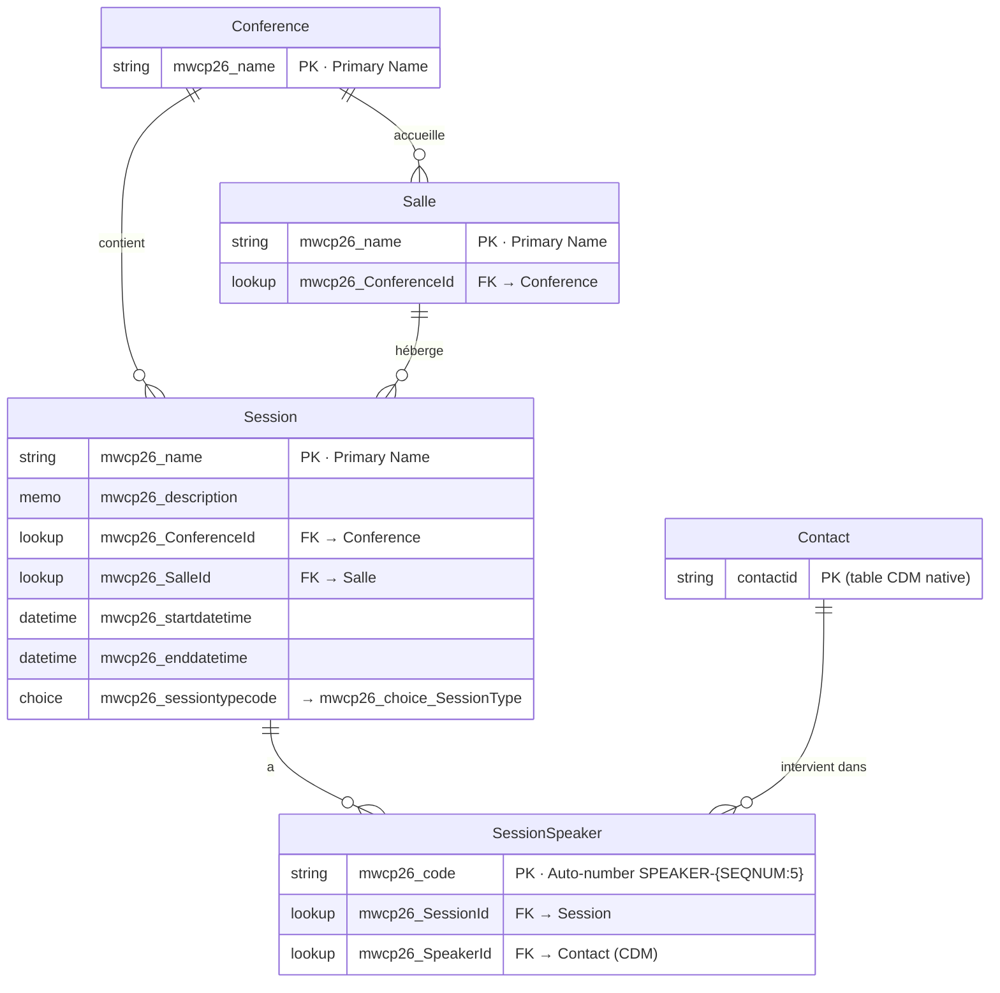

# MWCP26 — Modèle de données : Agenda de conférence

Solution : `mwcp26` | Préfixe : `mwcp26_` | Langue : Français

---

## Global Choices

### mwcp26_choice_SessionType

| Propriété     | Valeur                                          |
|---------------|-------------------------------------------------|
| Schema Name   | mwcp26_choice_SessionType                       |
| Display Name  | Type de session Choice                          |
| Description   | Catégorie visuelle de la session dans l'agenda  |

**Options**

| Display Name (FR) | Description |
|---|---|
| Session   | Session de conférence dans une salle, en parallèle d'autres sessions |
| Plénière  | Session sans autre session en parallèle |
| Pause     | Pause café |
| Repas     | Pause repas |
| Événement | Moment structurant (accueil, lancement, clôture, session sponsor…) |

---

## ERD

---

## Tables

### mwcp26_Conference

| Propriété             | Valeur                          |
|-----------------------|---------------------------------|
| Display Name          | Conférence                      |
| Display Name (plural) | Conférences                     |
| Schema Name           | mwcp26_Conference               |
| Logical Name          | mwcp26_conference               |
| Ownership             | UserOwned                       |
| Description           | Événement conférence principal  |

**Colonnes**

| Display Name (FR) | Schema Name  | Logical Name | Type          | Requis              |
|-------------------|--------------|--------------|---------------|---------------------|
| Nom               | mwcp26_name  | mwcp26_name  | String (100)  | ApplicationRequired |

---

### mwcp26_Salle

| Propriété             | Valeur                                     |
|-----------------------|--------------------------------------------|
| Display Name          | Salle                                      |
| Display Name (plural) | Salles                                     |
| Schema Name           | mwcp26_Salle                               |
| Logical Name          | mwcp26_salle                               |
| Ownership             | UserOwned                                  |
| Description           | Salle ou espace physique de la conférence  |

**Colonnes**

| Display Name (FR) | Schema Name          | Logical Name         | Type                      | Requis              |
|-------------------|----------------------|----------------------|---------------------------|---------------------|
| Nom               | mwcp26_name          | mwcp26_name          | String (100)              | ApplicationRequired |
| Conférence        | mwcp26_ConferenceId  | mwcp26_conferenceid  | Lookup → mwcp26_conference | None               |

---

### mwcp26_Session

| Propriété             | Valeur                                 |
|-----------------------|----------------------------------------|
| Display Name          | Session                                |
| Display Name (plural) | Sessions                               |
| Schema Name           | mwcp26_Session                         |
| Logical Name          | mwcp26_session                         |
| Ownership             | UserOwned                              |
| Description           | Session du programme de la conférence  |

**Colonnes**

| Display Name (FR) | Schema Name           | Logical Name          | Type                       | Requis              |
|-------------------|-----------------------|-----------------------|----------------------------|---------------------|
| Titre             | mwcp26_name           | mwcp26_name           | String (100)               | ApplicationRequired |
| Description       | mwcp26_description    | mwcp26_description    | Memo (2000)                | None                |
| Conférence        | mwcp26_ConferenceId   | mwcp26_conferenceid   | Lookup → mwcp26_conference | None                |
| Salle             | mwcp26_SalleId        | mwcp26_salleid        | Lookup → mwcp26_salle      | None                |
| Début             | mwcp26_startdatetime  | mwcp26_startdatetime  | DateTime (DateAndTime / UserLocal) | None        |
| Fin               | mwcp26_enddatetime    | mwcp26_enddatetime    | DateTime (DateAndTime / UserLocal) | None        |
| Type              | mwcp26_SessionTypeCode | mwcp26_sessiontypecode | Choice → mwcp26_choice_SessionType | None        |

---

### mwcp26_SessionSpeaker

| Propriété             | Valeur                                              |
|-----------------------|-----------------------------------------------------|
| Display Name          | Intervenant de Session                              |
| Display Name (plural) | Intervenants de Session                             |
| Schema Name           | mwcp26_SessionSpeaker                               |
| Logical Name          | mwcp26_sessionspeaker                               |
| Ownership             | UserOwned                                           |
| Description           | Association entre une session et un intervenant     |

**Colonnes**

| Display Name (FR) | Schema Name        | Logical Name       | Type                              | Requis              |
|-------------------|--------------------|--------------------|-----------------------------------|---------------------|
| Code              | mwcp26_code        | mwcp26_code        | String / Auto-number SPEAKER-{SEQNUM:5} | ApplicationRequired |
| Session           | mwcp26_SessionId   | mwcp26_sessionid   | Lookup → mwcp26_session           | None                |
| Intervenant       | mwcp26_SpeakerId   | mwcp26_speakerid   | Lookup → contact                  | None                |

---

### contact (CDM — natif)

Table standard Dataverse. Aucune colonne custom dans cette version.

---

## Open questions

- [ ] Faut-il un champ Capacité (entier) sur les Salles ?
- [x] ~~Faut-il un statut (Brouillon / Confirmé / Annulé) sur les Sessions — global Choice ?~~ → Hors scope v1 ; à distinguer du **type** (`mwcp26_SessionType`) qui pilote l'affichage.
- [ ] La table Contact CDM est-elle suffisante ou faut-il une table Speaker dédiée avec bio, photo, réseaux ?
